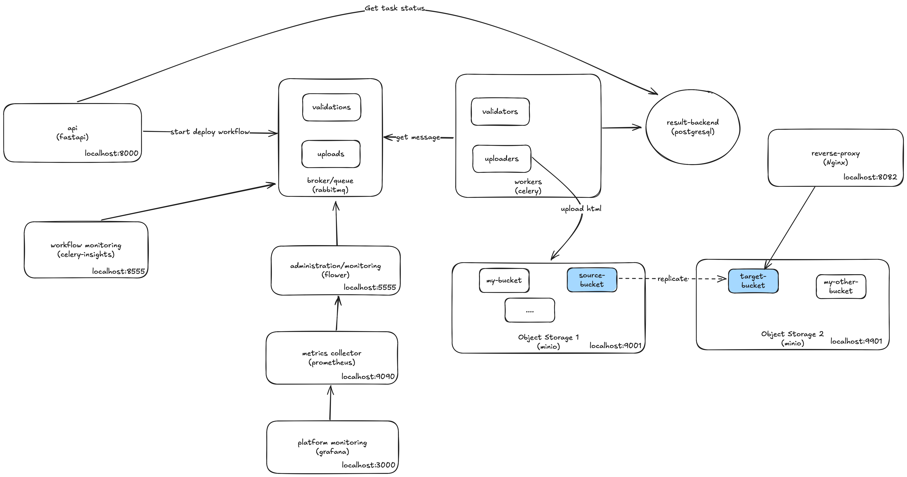
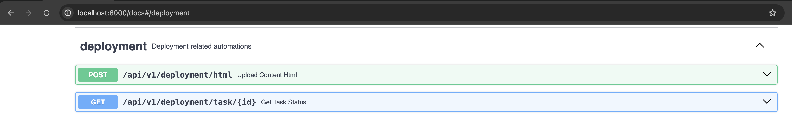
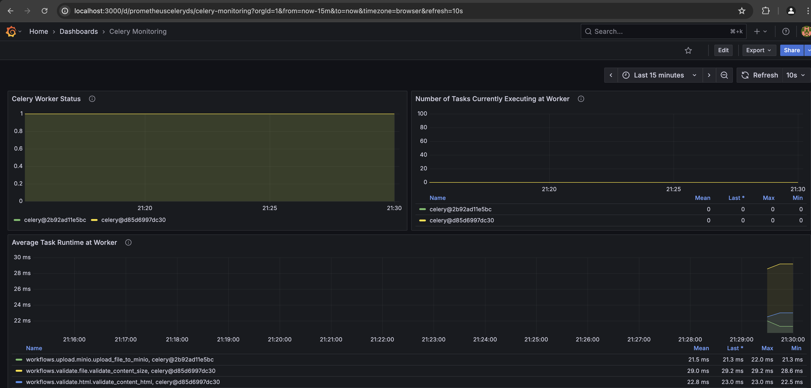
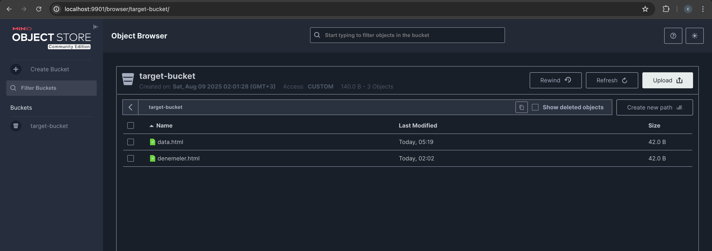
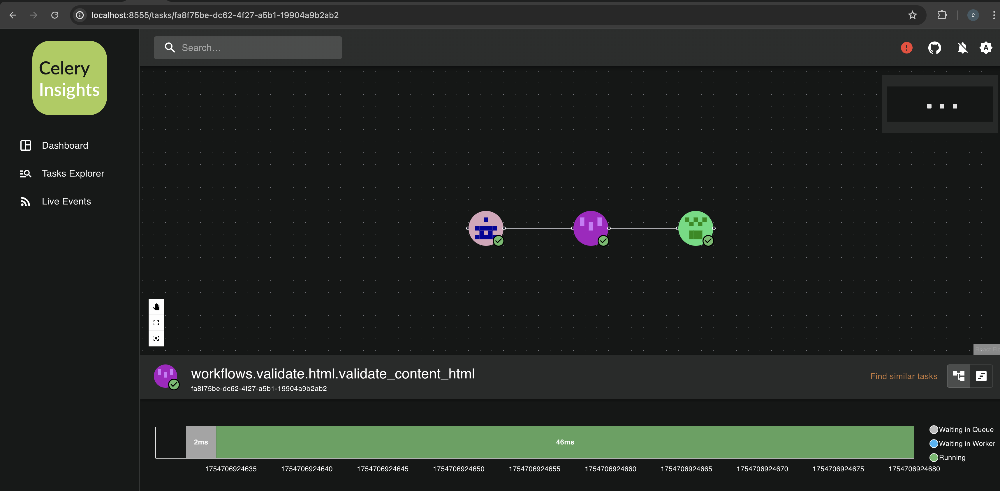

## Introduction
**DeployFlow** is a cloud-native platform designed as proof of concept for deploying html files to object storage using workflows. It integrates various services such as RabbitMQ, PostgreSQL, MinIO, and Prometheus to provide a simple html file deployment solution :))

## Topology


The platform is built using Docker and Docker Compose, enabling easy deployment and management of microservices. It also includes a pre-configured NGINX proxy for serving static files on object storage.

## Features
- **API Services**: Provides RESTful APIs for deploying html files and getting status of workflows.

- **Workers**: Listens related message queues and handles background tasks such as file uploads and validations using Celery.
- **Monitoring**: Includes Prometheus and Grafana for real-time monitoring and visualization.

- **Message Queue**: RabbitMQ for reliable message delivery between services.
- **Object Storage**: 2 MinIO instances for scalable and secure object storage. It replicates files from minio1's **source bucket** to minio2's **target bucket**.

- **Database**: PostgreSQL for persistent data storage and PG Admin for monitoring and administration.
- **Dashboard**: Celery Flower dashboard and Celery Insights for monitoring tasks, task queues and workers.


## Getting Started
### Prerequisites
- Docker (version 20.10 or later)
- Docker Compose (version 1.29 or later)

### Installation
1. Clone the repository:
   ```bash
   git clone https://github.com/haidouks/DeployFlow
   cd DeployFlow
   ```

2. Start the services:
   ```bash
   docker-compose up --build
   ```

3. Access the services:
   - API: `http://localhost:8000/docs`
   - NGINX Proxy: `http://localhost:8082`
   - Grafana: `http://localhost:3000`
   - Prometheus: `http://localhost:9090`
   - Flower Dashboard: `http://localhost:5555`
   - Celery Insights: `http://localhost:8555`
   - Minio 1: `http://localhost:9001`
   - Minio 2: `http://localhost:9901`
   - PG Admin: `http://localhost:8081`


### Example Scenario
Here is an example of how the application works step by step:

1. **Start the Workflow**: API is called with the HTML file name, content and bucket details to start the workflow. Tracking id returns to client which can be used to get the status of workflow. 

2. **Validation Tasks**: The file size and HTML format are validated by workers responsible for the `validations` queue.

3. **Upload to MinIO**:   - If no errors occur during validation, the file is uploaded to the `source-bucket` in MinIO-1 by a worker responsible for the `uploads` queue.

4. **Replication to MinIO-2**:   - MinIO-1's `source-bucket` is configured to replicate files to MinIO-2's `target-bucket`.

5. **NGINX Reverse Proxy**:   - MinIO-2's `target-bucket` is exposed via an NGINX reverse proxy, allowing the file to be accessed through a browser.

6. **Direct Hosting**:   - Once the HTML file is placed in MinIO-1's `source-bucket`, it can be accessed directly through the NGINX proxy without additional steps.

7. **Monitoring and Logging**:   - Throughout the process, tools like Insights, Grafana, Flower, and PGAdmin can be used to monitor metrics and logs